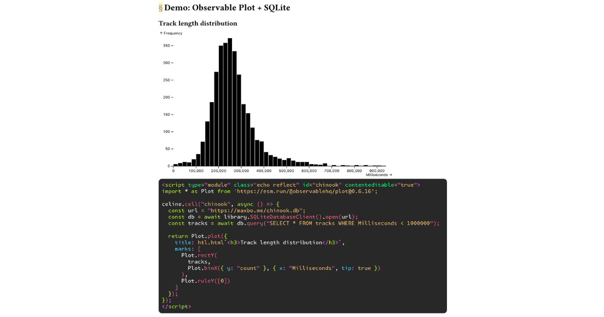

# @celine project monorepo

The website for the whole project is [maxbo.me/celine](https://maxbo.me/celine/).

This monorepo contains the following packages:
- [/celine](https://github.com/MaxwellBo/celine/tree/master/celine), published as [@celine/celine](https://jsr.io/@celine/celine) on [JSR](https://jsr.io).
- [/libertine](https://github.com/MaxwellBo/celine/tree/master/libertine), published as [@celine/libertine](https://jsr.io/@celine/libertine) on JSR.
- [/bibhtml](https://github.com/MaxwellBo/celine/tree/master/libertine) is experimental and unpublished.

